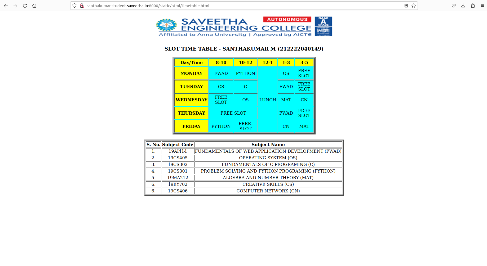

# Experiment_Time_Table

## AIM

To Write a html webpage page to display your timetable.

# ALGORITHM

### STEP 1

create a simple table using table tag

### STEP 2

Add header row using th tag

### STEP 3

Add your timetable

### STEP 4

Execute the program

# CODE
```
<!DOCTYPE html>
<html lang="en">
<head>

<title>Slot Timetable</title>
<style>
    div{
        text-align: center;
       
    }
    table{
        margin-left: auto;
        margin-right: auto;
    }

  
</style>
</head>
<body>
    <div>


<br>
<table  width="540" cellspacing="2" cellpadding="4" border="5" bgcolor="cyan">
<h3 align="center"> SLOT TIME TABLE - SANTHAKUMAR M (212222040149)</h3>
<tr align="center">
<th bgcolor="yellow">Day/Time</th>
<th bgcolor="yellow">8-10</th>
<th bgcolor="yellow">10-12</th>
<th bgcolor="yellow">12-1</th>
<th bgcolor="yellow">1-3</th>
<th bgcolor="yellow">3-5</th>
</tr>
<tr align="center">
<th bgcolor="yellow">MONDAY</th>
<td >FWAD</td>
<td>PYTHON</td>
<td rowspan="5">LUNCH</td>
<td >OS</td>
<td >FREE SLOT</td>

</tr>
<tr align="center">
<th bgcolor="yellow">TUESDAY</th>
<td>CS</td>
<td> C </td>
<td>FWAD</td>
<td >FREE SLOT</td>

</tr>
<tr>
<th bgcolor="yellow">WEDNESDAY</th>
<td>FREE SLOT</td>
<td >OS</td>
<td >MAT</td>
<td >CN</td>

</tr>
<tr align="center">
<th bgcolor="yellow">THURSDAY</th>
<td colspan="2"> FREE SLOT </td>
<td >FWAD</td>
<td >FREE SLOT</td>
</tr>
<tr align="center">
<th bgcolor="yellow">FRIDAY</th>
<td> PYTHON </td>
<td>FREE-SLOT</td>
<td>CN</td>
<td>MAT</td>
</tr>
</table>
<br>
<table border="5">
<tr align="center">
<th>S. No.</th>
<th>Subject Code</th>
<th>Subject Name</th>
</tr>
<tr>
<td align="center">1.</td>
<td align="center">19AI414</td>
<td>FUNDAMENTALS OF WEB APPLICATION DEVELOPMENT (FWAD)</td>
</tr>
<tr>
<td align="center">2.</td>
<td align="center">19CS405</td>
<td>OPERATING SYSTEM (OS)</td>
</tr>
<tr>
<td align="center">3.</td>
<td align="center">19CS302</td>
<td>FUNDAMENTALS OF C PROGRAMING (C)</td>
</tr>
<tr>
<td align="center">4.</td>
<td align="center">19CS301</td>
<td>PROBLEM SOLVING AND PYTHON PROGRAMING (PYTHON)</td>
</tr>
<tr>
<td align="center">5.</td>
<td align="center">19MA212</td>
<td>ALGEBRA AND NUMBER THEORY (MAT)</td>
</tr>
<tr>
<td align="center">6.</td>
<td align="center">19EY702</td>
<td>CREATIVE SKILLS (CS)</td>
</tr>
<tr>
<td align="center">6.</td>
<td align="center">19CS406</td>
<td>COMPUTER NETWORK (CN)</td>
</tr>
</table>
</div>
</body>
</html>
```

# OUTPUT



# RESULT

The program for creating Timetable is completed successfully.
